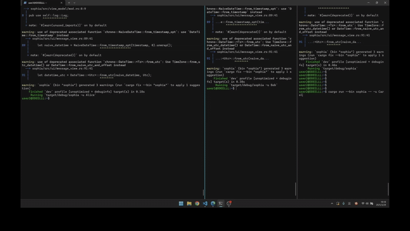
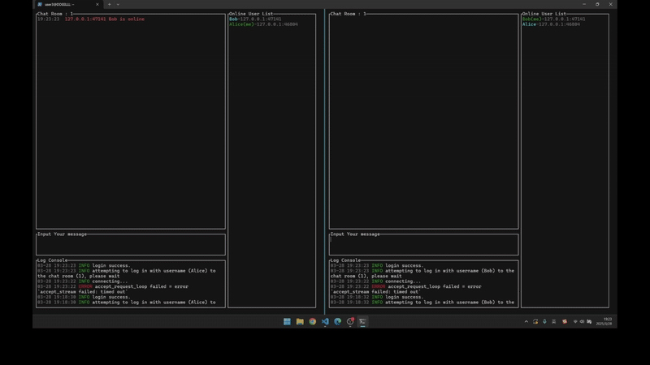

# ChatRoom-Plus
This is the final project for dyq's Rust programming course.
## Overview
ChatRoom-Plus is a real-time chat application running on Linux servers, allowing connected users to communicate instantly with private messaging capabilities and a collaborative Wordle mini-game.
This project refactors the open-source project from https://github.com/fanlv/chat-room.git, adding:
* [Private Messaging](#private-messaging)
* [Wordle Mini-Game](#wordle-mini-game)

| Feature          | Original Project | ChatRoom-Plus |
|------------------|------------------|---------------|
| Private Messages | ×                | ✓             |
| Wordle Game      | ×                | ✓             |
| Multi-Platform   | ✓                | ✓             |
## Getting Started
Run Server :
```bash
cargo run --bin sophia-server
```

Run Client :
```bash
cargo run --bin sophia -u Alice
```

## Real-time Chat Room
The sophia-server runs on a Linux server, and any user can join the chat room by running the sophia client. Once connected, users can:
* View messages from others in real-time
* Send their own messages
ChatRoom-Plus is ideal for remote work and collaborative development scenarios

## Private Messaging
Users in the same chat room can exchange private messages (whispers) that remain invisible to others. Simply prefix your message with `@Username + secret message`.
```
@Alice ​Just between us......
```


## Wordle Mini-Game
Wordle is a popular word-guessing game where players have six attempts to guess a five-letter word, receiving color-coded feedback after each try.
Chat room users can:
* Interact with Wordle-bot
* Submit guesses and receive feedback
* Compete with friends to solve the puzzle first


## Demo Video
For clearer demonstration than the GIFs, watch our demo video:

[Demo vedio link](https://disk.pku.edu.cn/link/AA22544C1DD8DA4569A1BDEE6E5BFCC3C1)